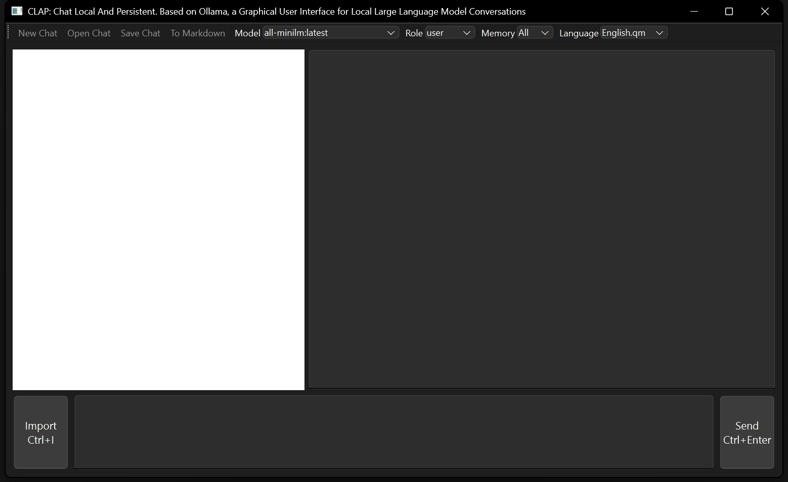
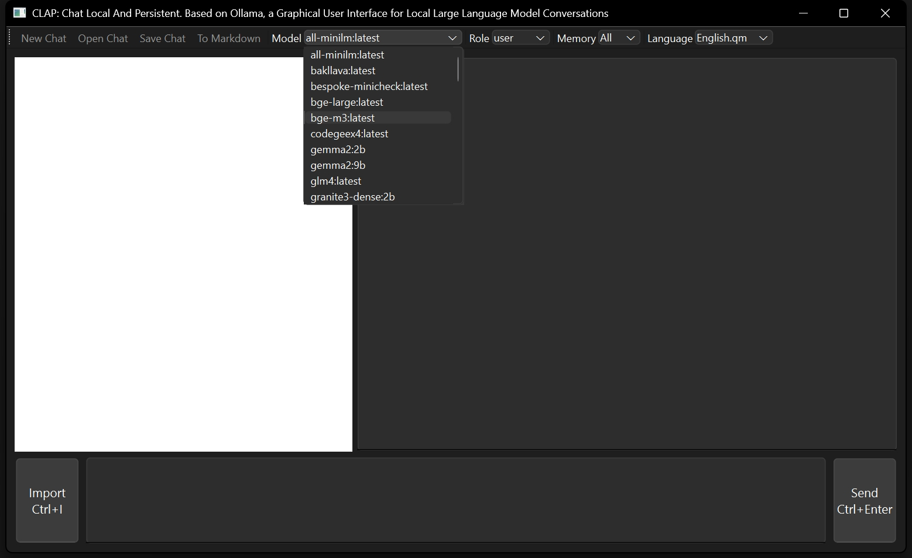
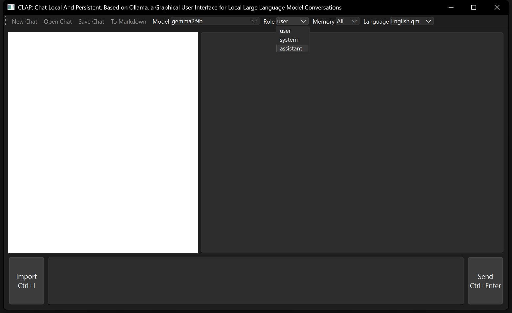
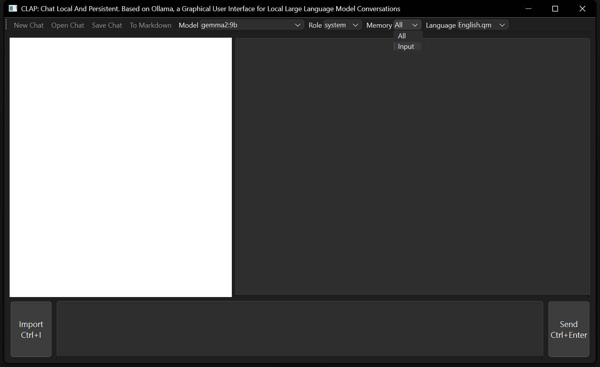
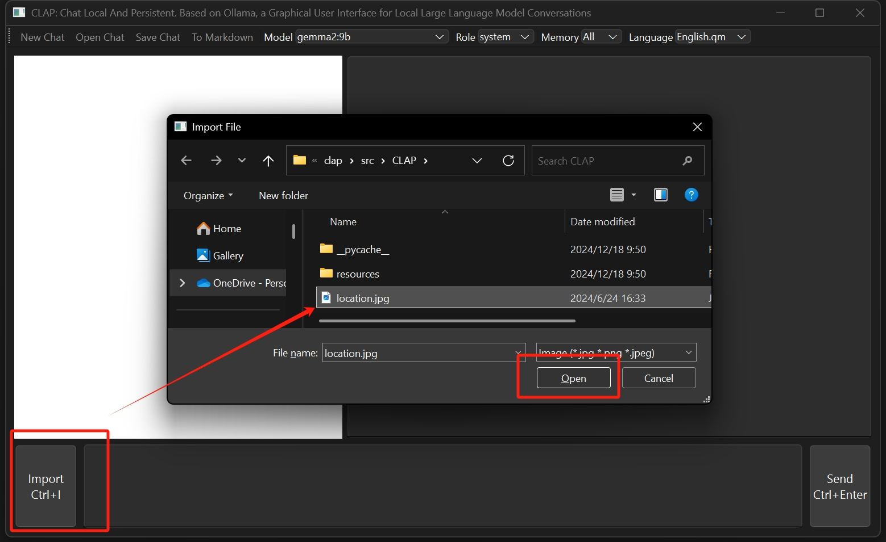
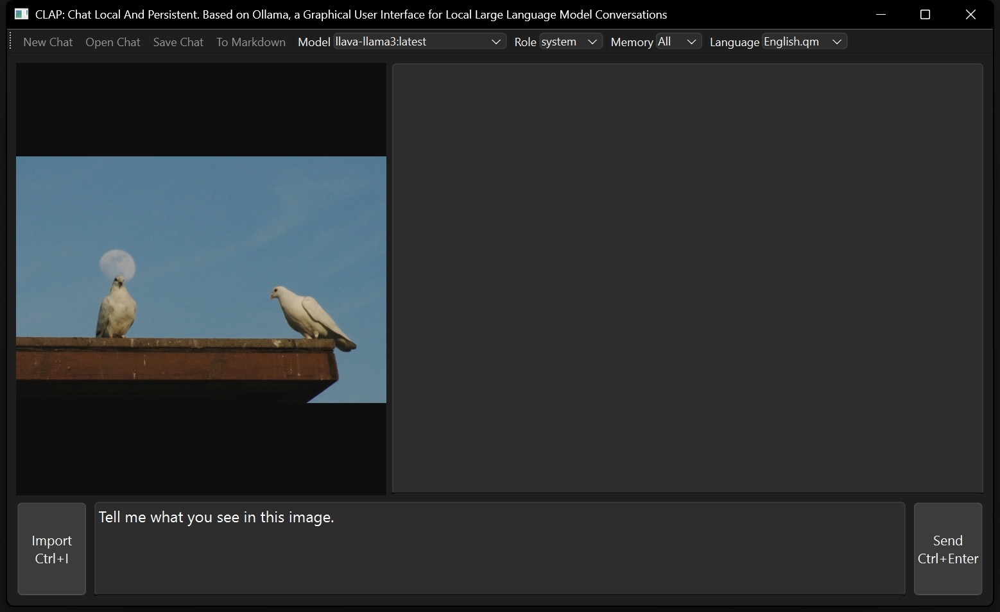
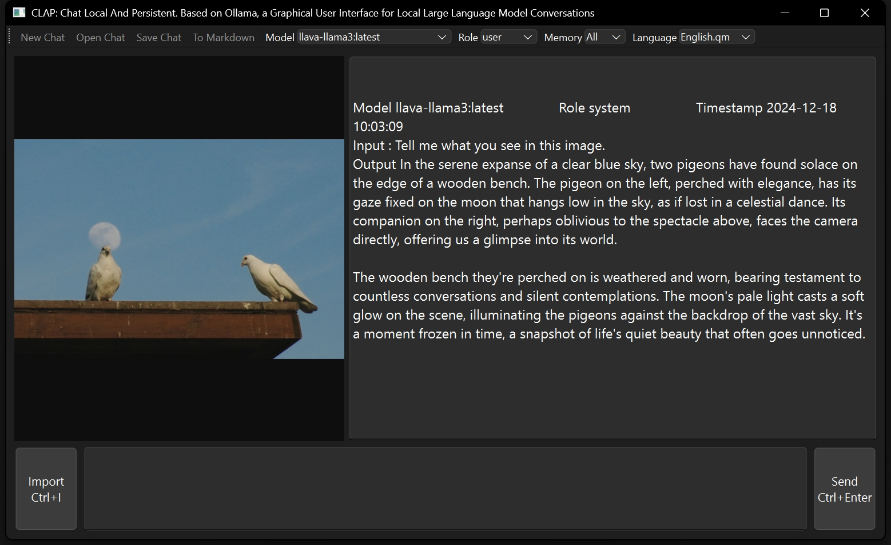
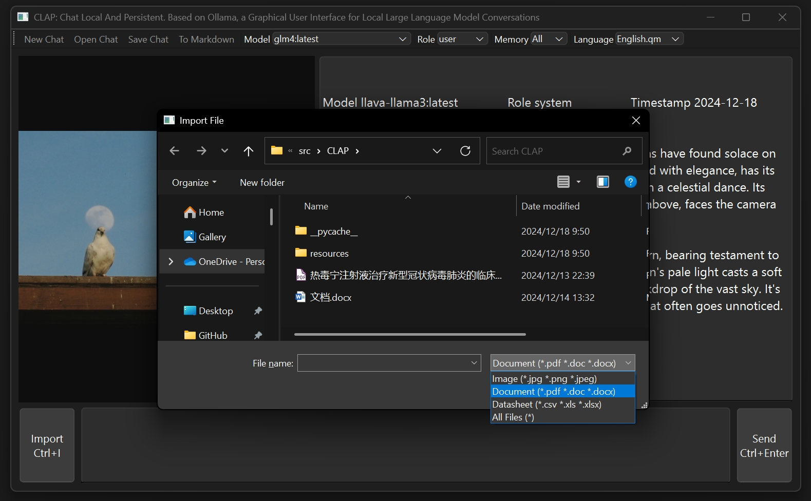
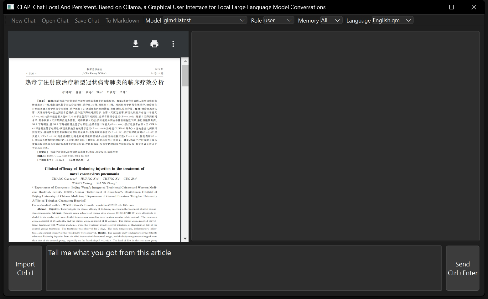
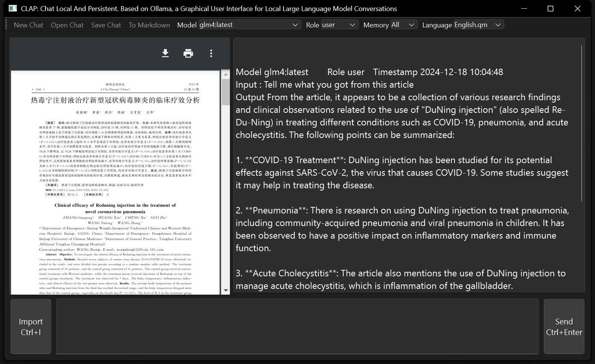

# CLAP: Chat Local And Persistent – Design and Implementation of Contextual Dialogue Loadable under Privacy-Sensitive Network Scenarios with the Ollama Framework’s Local Large Language Model Semantic Interaction Software

**Version:** 1.0.0

## 1. Introduction

In recent years, the internet has permeated every aspect of daily life, and online services, epitomized by large language models (LLMs), have become the darlings of the digital age. However, the use of LLMs in privacy-sensitive contexts poses certain privacy risks and confronts users with the challenge of dialogue continuity.

Regarding privacy, LLMs that rely on network access are susceptible to man-in-the-middle attacks during conversation sessions. Furthermore, user interactions with service providers may lead to the collection of dialogue data, potentially utilized for purposes beyond the original intent.
On another front, without proper archiving of online conversations, resuming previous discussions becomes difficult in privacy-conscious scenarios. Additionally, ensuring the sanitization and deletion of dialogue records is a formidable task.

To address these issues, we present `CLAP`, short for "Chat Local And Persistent." This software is designed for local, persistent dialogues and is built atop the `Ollama` framework, leveraging `Ollama-Python` to interface with locally managed LLMs. `CLAP` facilitates interaction with local LLMs while storing dialogue locally in binary files with a `.clap` extension, enabling users to load these files for dialogue continuation. It also supports exporting dialogue transcripts as Markdown documents.

Featuring a graphical user interface (GUI), `CLAP` enables semantic interaction with local LLMs offline, ensuring privacy and data independence. Developed in Python, it enjoys broad compatibility across platforms, including Windows 10/11 and GNU/Linux.

The development harnesses PySide6 for GUI design and BeeWare for project packaging, ensuring stability and ease of use.

## 2. Environment

Benefitting from the cross-platform capabilities of PySide6 and other foundational libraries, `CLAP` operates seamlessly across various hardware and OS environments. It offers flexible installation options catering to diverse user needs and system configurations, enabling secure, efficient, and platform-agnostic interaction with local LLMs.

To use `CLAP`, users must first download the Ollama framework from its [official website](https://ollama.com/download). Subsequently, they execute a command such as `ollama pull gemma:2b` to download a chosen offline LLM model, which defaults to being stored in `~/.ollama/models/`. Note that while Ollama installation and model downloads require an internet connection, once completed, `CLAP` can operate entirely offline.

### 2.1 Development Environment

The development environment includes:

| Component | Version | Purpose |
|-----------|---------|---------|
| ollama    | 0.1.41  | LLM runtime tool |
| ollama-python | 0.2.0 | Python interface for LLMs |
| Python    | 3.12    | Runtime support |
| PySide6   | 6.6.2   | GUI library |
| beeware   | 0.3.0   | Project framework |
| briefcase | 0.3.16  | Packaging tool |
| matplotlib | 3.8.3 | Plotting library |
| numpy     | 1.26.4  | Numerical computing |
| pandas    | 2.2.1   | Data analysis |
| scipy     | 1.12.0  | Scientific computing |
| toga      | 0.4.2   | Native GUI toolkit |
| toga-chart| 0.2.0   | Chart components for Toga |
| openpyxl  | 3.1.2   | Excel file handling |
| scikit-learn | 1.4.1.post1 | Machine learning library |

### 2.2 Hardware Requirements

Minimum hardware specifications include:

| Component | Requirement |
|-----------|-------------|
| Processor | Dual-core, 64-bit, 1GHz+ (Intel/AMD x86_64, ARM64) |
| GPU       | CUDA12.1 compatible |
| RAM       | 8GB+ |
| Disk Space | 128GB+ |

### 2.3 System Requirements

Supported operating systems:

| OS         | Minimum Version | Architecture |
|------------|-----------------|--------------|
| Windows 10 | 1809            | 64-bit       |
| Windows 11 | 23H2            | 64-bit       |
| Ubuntu     | 22.04.4         | 64-bit       |

## 3. Installation

## 3.1 Install Ollama first

Before installing `CLAP`, ensure that the Ollama framework is correctly installed and configured. Follow the official Ollama installation guide to set up the environment and download the desired LLM model.

Please navigate to the ollama website for detailed instructions: https://ollama.com/download  .
And download the model you want to use after installing Ollama.
For example, you can use the following command to download the gemma model:
```bash
ollama pull gemma:2b
```

## 3.2 Clone and Run from Source

Suitable for all OS users, especially GNU/Linux users, requiring Python 3.10+ and Ollama dependencies.

Clone the repository and install dependencies, then run the application. 
The commands are as follows:
```bash
git clone https://github.com/cycleuser/CLAP.git
cd CLAP
pip insall -r requirements.txt
cd clap
python src\CLAP\app.py
# Or briefcase dev
```

# 4 Interface





















